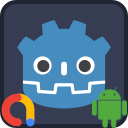
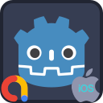

<p align="center">
	
	&nbsp;&nbsp;&nbsp;&nbsp;&nbsp;&nbsp;
	
</p>

---

#  Godot Admob Plugin

A Godot plugin that provides a unified GDScript interface for integrating **Google Mobile Ads SDK** on **Android** and **iOS**.

**Key Features:**
- Load and show...
  - Banner Ads
  - Interstitial Ads
  - Rewarded Video Ads
  - Rewarded Interstitial Ads
  - App Open Ads
- Emits signals when ads are loaded, viewed, clicked, dismissed, rewards received, & more
- Allows configuration of all settings on a node
- Works with Google AdMob ad network by default
- Allows enabling of 15 additional ad networks
- Provides two export configuration options:
  - Node-based
  - File-based

---

##  Table of Contents
- [Prerequisites](#prerequisites)
- [Installation](#installation)
- [Usage](#usage)
- [Signals](#signals)
- [Banner Ads](#banner-ads)
- [App Open Ads](#app-open-ads)
- [User Consent](#user-consent)
- [Multi-scene Projects](#multi-scene-projects)
- [Mediation](#mediation)
- [Export](#export)
- [Platform-Specific Notes](#platform-specific-notes)
- [Video Tutorial](#video-tutorial)
- [Links](#links)
- [All Plugins](#all-plugins)
- [Credits](#credits)
- [Contributing](#contributing)

---

<a name="prerequisites"></a>

##  Prerequisites
Create an AdMob account at the following link:
- [Google AdMob](https://admob.google.com/)

Using the AdMob console:
- create an app and link it to the app's store listing
- [create ad(s)](https://support.google.com/admob/answer/6173650?hl=en) for your app via the AdMob console
- if needed, [create consent form(s)](https://support.google.com/admob/answer/10113207?hl=en) for your app via the AdMob console

---

<a name="installation"></a>

##  Installation
_Before installing this plugin, make sure to uninstall any previous versions of the same plugin._

_If installing both Android and iOS versions of the plugin in the same project, then make sure that both versions use the same addon interface version._

There are 2 ways to install the `Admob` plugin into your project:
- Through the Godot Editor's AssetLib
- Manually by downloading archives from Github

###  Installing via AssetLib
Steps:
- search for and select the `Admob` plugin in Godot Editor
- click `Download` button
- on the installation dialog...
	- keep `Change Install Folder` setting pointing to your project's root directory
	- keep `Ignore asset root` checkbox checked
	- click `Install` button
- enable the plugin via the `Plugins` tab of `Project->Project Settings...` menu, in the Godot Editor

####  Installing both Android and iOS versions of the plugin in the same project
When installing via AssetLib, the installer may display a warning that states "_[x number of]_ files conflict with your project and won't be installed." You can ignore this warning since both versions use the same addon code.

###  Installing manually
Steps:
- download release archive from Github
- unzip the release archive
- copy to your Godot project's root directory
- enable the plugin via the `Plugins` tab of `Project->Project Settings...` menu, in the Godot Editor


##  Supported Ad Types

The following ad types are supported:

- Banner
- Interstitial
- Rewarded
- Rewarded Interstitial
- App Open

---

<a name="usage"></a>


##  Usage
- Add `Admob` node to your main scene and populate the ID fields of the node
	- Debug IDs will only be used when your Godot app is run in debug mode
	- Real IDs will only be used when the `is_real` field of the node is set to `true`

###  Loading and displaying ads
- initialize the plugin
	- call the `initialize()` method of the `Admob` node
	- wait for the `initialization_completed` signal
- use one or more of the following `load_*()` methods to load ads from the `Admob` node:
	- `load_banner_ad(ad_request: LoadAdRequest)`
	- `load_interstitia_adl(ad_request: LoadAdRequest)`
	- `load_rewarded_ad(ad_request: LoadAdRequest)`
	- `load_rewarded_interstitial_ad(ad_request: LoadAdRequest)`
	- `load_app_open_ad(ad_unit_id: String, auto_show_on_resume: boolean)`
- the `Admob` node will emit the following signals once ads have been loaded or failed to load:
	- `banner_ad_loaded(ad_id: String)`
	- `banner_ad_failed_to_load(ad_id: String, error_data: LoadAdError)`
	- `interstitial_ad_loaded(ad_id: String)`
	- `interstitial_ad_failed_to_load(ad_id: String, error_data: LoadAdError)`
	- `rewarded_ad_loaded(ad_id: String)`
	- `rewarded_ad_failed_to_load(ad_id: String, error_data: LoadAdError)`
	- `rewarded_interstitial_ad_loaded(ad_id: String)`
	- `rewarded_interstitial_ad_failed_to_load(ad_id: String, error_data: LoadAdError)`
	- `app_open_ad_loaded(ad_unit_id: String)`
	- `app_open_ad_failed_to_load(ad_unit_id: String, error_data: LoadAdError)`
- once ads have been loaded, call corresponding `show_*()` method from the `Admob` node with the `ad_id` received:
	- `show_banner_ad(ad_id: String)`
	- `show_interstitial_ad(ad_id: String)`
	- `show_rewarded_ad(ad_id: String)`
	- `show_rewarded_interstitial_ad(ad_id: String)`
	- `show_app_open_ad()`

---

<a name="signals"></a>

###  Signals
- register listeners for one or more of the following signals of the `Admob` node:
	- `initialization_completed(status_data: InitializationStatus)`
	- `banner_ad_loaded(ad_id: String, response_info: ResponseInfo)`
	- `banner_ad_failed_to_load(ad_id: String, error_data: LoadAdError)`
	- `banner_ad_refreshed(ad_id: String, response_info: ResponseInfo)`
	- `banner_ad_clicked(ad_id: String)`
	- `banner_ad_impression(ad_id: String)`
	- `banner_ad_opened(ad_id: String)`
	- `banner_ad_closed(ad_id: String)`
	- `interstitial_ad_loaded(ad_id: String, response_info: ResponseInfo)`
	- `interstitial_ad_failed_to_load(ad_id: String, error_data: LoadAdError)`
	- `interstitial_ad_refreshed(ad_id: String, response_info: ResponseInfo)`
	- `interstitial_ad_impression(ad_id: String)`
	- `interstitial_ad_clicked(ad_id: String)`
	- `interstitial_ad_showed_full_screen_content(ad_id: String)`
	- `interstitial_ad_failed_to_show_full_screen_content(ad_id: String, error_data: AdError)`
	- `interstitial_ad_dismissed_full_screen_content(ad_id: String)`
	- `rewarded_ad_loaded(ad_id: String, response_info: ResponseInfo)`
	- `rewarded_ad_failed_to_load(ad_id: String, error_data: LoadAdError)`
	- `rewarded_ad_impression(ad_id: String)`
	- `rewarded_ad_clicked(ad_id: String)`
	- `rewarded_ad_showed_full_screen_content(ad_id: String)`
	- `rewarded_ad_failed_to_show_full_screen_content(ad_id: String, error_data: AdError)`
	- `rewarded_ad_dismissed_full_screen_content(ad_id: String)`
	- `rewarded_ad_user_earned_reward(ad_id: String, reward_data: RewardItem)`
	- `rewarded_interstitial_ad_loaded(ad_id: String, response_info: ResponseInfo)`
	- `rewarded_interstitial_ad_failed_to_load(ad_id: String, error_data: LoadAdError)`
	- `rewarded_interstitial_ad_impression(ad_id: String)`
	- `rewarded_interstitial_ad_clicked(ad_id: String)`
	- `rewarded_interstitial_ad_showed_full_screen_content(ad_id: String)`
	- `rewarded_interstitial_ad_failed_to_show_full_screen_content(ad_id: String, error_data: AdError)`
	- `rewarded_interstitial_ad_dismissed_full_screen_content(ad_id: String)`
	- `rewarded_interstitial_ad_user_earned_reward(ad_id: String, reward_data: RewardItem)`
	- `app_open_ad_loaded(ad_unit_id: String, response_info: ResponseInfo)`
	- `app_open_ad_failed_to_load(ad_unit_id: String, error_data: LoadAdError)`
	- `app_open_ad_impression(ad_unit_id: String)`
	- `app_open_ad_clicked(ad_unit_id: String)`
	- `app_open_ad_showed_full_screen_content(ad_unit_id: String)`
	- `app_open_ad_failed_to_show_full_screen_content(ad_unit_id: String, error_data: AdError)`
	- `app_open_ad_dismissed_full_screen_content(ad_unit_id: String)`
	- `consent_form_loaded`
	- `consent_form_dismissed(error_data: FormError)`
	- `consent_form_failed_to_load(error_data: FormError)`
	- `consent_info_updated`
	- `consent_info_update_failed(error_data: FormError)`

---

<a name="banner-ads"></a>

###  Banner Ads
Banner ads can be categorized as:

- Adaptive Banner Ads
- Fixed-size Banner Ads
- Collapsible Banner Ads

####  Banner Position
Banner position can be set to the following values:

- TOP
- BOTTOM
- LEFT
- RIGHT
- TOP-LEFT
- TOP-RIGHT
- BOTTOM-LEFT
- BOTTOM-RIGHT
- CENTER

####  Banner Size
- The following methods return the size of a Banner ad:
	- `get_banner_dimension()`
	- `get_banner_dimension_in_pixels()`
- These methods are not supported for `FLUID` sized ads. For banner ads of size `FLUID`, the `get_banner_dimension()` method will return `(-3, -4)` and the `get_banner_dimension_in_pixels()` method will return `(-1, -1)`.

####  Collapsible Banner Ads
Collapsible banner ads are banner ads that are initially presented as a larger overlay with a button to collapse them to their originally-requested banner size. Collapsible banner ads can be requested by setting the `collapsible position` value to `TOP` or `BOTTOM`.

**Note that if `collapsible position` value is in conflict with the [`banner position`](#banner-position) value, then the collapsible banner ad may not function as intended. Set `banner position` and `collapsible position` to the same value for the best experience.**

---

<a name="app-open-ads"></a>

###  App Open Ads
App open ads are a special ad format intended for publishers wishing to monetize their app load screens. App open ads can be closed at any time, and are designed to be shown at startup or when your users bring your app to the foreground.

Set `auto_show_on_resume` to `true` in order to show app open ads when users resume (bring from background to foreground) your app. The app open ad should be loaded via the `load_app_open_ad()` method before it can be displayed at startup or upon resumption. Ideally, invoke the `load_app_open_ad()` method at startup and, if `auto_show_on_resume` is enabled, upon each `app_open_ad_impression` signal.

---

<a name="user-consent"></a>

###  User Consent
- Methods:
	- `get_consent_status()` - Returns a consent status value defined in `ConsentInformation.gd`
	- `update_consent_info(params: ConsentRequestParameters)` - To be called if `get_consent_status()` returns status UNKNOWN.
	- `reset_consent_info()` - To be used only when testing and debugging your application.
	- `is_consent_form_available()`
	- `load_consent_form()` - To be called if `get_consent_status()` returns status REQUIRED and `is_consent_form_available()` returns `false`.
	- `show_consent_form()` - To be called after `consent_form_loaded` signal has been emitted or `is_consent_form_available()` returns `true`.

---

<a name="multi-scene-projects"></a>

###  Multi-scene projects

The recommended way to use the `Admob Plugin` in a multi-scene Godot project is as follows:

1. Create a new scene for managing Ads (ie. named `AdManager`).
	 - Attach a script to the root node
2. Add an `Admob` node to the new scene
	 - `@onready`, link to an `admob_node` variable
3. Connect all signals and keep all ad logic in this script
4. From Godot Editor's `Project->Project Settings...` menu, select the `Globals` tab
	 - Set this new scene as an `Autoload`

After setting this scene as an `Autoload`, the `Admob Plugin` methods can be invoked from any scene as shown in the following example:

```
AdManager.admob_node.show_banner()
```

---

<a name="mediation"></a>

##  Mediation

Admob Plugin's mediation feature allows selection of up to 15 additional ad mediation networks to serve your ads.  For efficiency, <u>**the plugin will only add the SDKs of enabled networks**</u> to your app.

Admob Plugin makes the following ad networks available:

- Google AdMob (enabled by default)
- AppLovin
- Chartboost
- DT Exchange
- i-mobile
- InMobi
- Liftoff Monetize
- LINE Ads Network
- maio
- Meta Audience Network
- Mintegral
- Moloco
- myTarget
- Pangle
- Unity Ads

The networks that you choose will also need to be enabled via your AdMob Console for them to be available to your app.

---

<a name="export"></a>

##  Export
Both `Android` and `iOS` exports require several configuration settings.

###  File-based Export Configuration
In order to enable file-based export configuration, an `android_export.cfg` or an `ios_export.cfg` file should be placed in the `addons/AdmobPlugin` directory with the file contents formatted as in the example below:

```
[General]
is_real = false

[Debug]
app_id = "ca-app-pub-3940256099942544~3347511713"

[Release]
app_id = "ca-app-pub-3940256099942544~3347511713"

[Mediation]
enabled_networks = ["applovin", "unity"]
```

The `ios_export.cfg` file supports the following additional properties, which are not relevant for Android.

```
[ATT]
att_enabled = true
att_text = "My ATT text."
```

The `is_real` and `app_id` configuration items are mandatory and if not found in the `export.cfg` file, then the plugin will fall back to node-based configuration.

###  Node-based Export Configuration
If `<platform>_export.cfg` file is not found for the target platform or file-based configuration fails, then the plugin will attempt to load node-based configuration.

During export, the plugin searches for an `Admob` node in the scene that is open in the Godot Editor. If not found, then the plugin searches for an `Admob` node in the project's main scene. Therefore;
- Make sure that the scene that contains the `Admob` node is selected in the Godot Editor when building and exporting, or
- Make sure that your Godot project's main scene contains an `Admob` node

---

<a name="platform-specific-notes"></a>

##  Platform-Specific Notes

### Android
- Download Android export template and enable gradle build from export settings
- **Missing APP ID:**
  - If your game crashes due to missing APP ID, then make sure that you
    - enter your Admob APP ID in the Admob node and pay attention to the [Android Export section](#android-export).
    - or enter it in the `android_export.cfg` file as described in the [File-based Export](#export) section.
- **Troubleshooting:**
  - Logs: `adb logcat | grep 'godot'` (Linux), `adb.exe logcat | select-string "godot"` (Windows)
  - You may find the following resources helpful:
    - https://docs.godotengine.org/en/stable/tutorials/export/exporting_for_android.html
    - https://developer.android.com/tools/adb
    - https://developer.android.com/studio/debug
    - https://developer.android.com/courses

### iOS
- Follow instructions on [Exporting for iOS](https://docs.godotengine.org/en/stable/tutorials/export/exporting_for_ios.html)
- **Missing APP ID** crashes: make sure that you
  - enter your Admob APP ID in the Admob node and pay attention to the [iOS Export section](#ios-export).
  - or enter it in the `android_export.cfg` file as described in the [File-based Export](#export) section.
- View XCode logs while running the game for troubleshooting.
- See [Godot iOS Export Troubleshooting](https://docs.godotengine.org/en/stable/tutorials/export/exporting_for_ios.html#troubleshooting).
- **App Tracking Transparency**, or ATT for short, is Apple's opt-in privacy framework that requires all iOS apps to ask users for permission to share their data. This is done in the form of a popup where users can either consent or deny tracking.
  - To enable ATT in your app
    - Enter a descriptive text that will be displayed on the ATT dialog in your `Admob` node's `att_text`field.
    - Call `Admob` node's `request_tracking_authorization()` method.
    - Handle `Admob` node's `tracking_authorization_granted` and `tracking_authorization_denied` signals.
    - If the user initially rejects the tracking request, then later on you can check if the user changed their mind and allow them to update their settings by opening the system app settings using the `Admob` node's `open_app_settings()` method.

---

<a name="video-tutorial"></a>

#  Video Tutorial

[](https://www.youtube.com/watch?v=V9_Gpy0R3RE)

---

<a name="links"></a>

#  Links

- [AssetLib Entry Android](https://godotengine.org/asset-library/asset/2548)
- [AssetLib Entry iOS](https://godotengine.org/asset-library/asset/3178)

---
#  All Plugins

| Plugin | Android | iOS |
| :---: | :--- | :--- |
| [Notification Scheduler](https://github.com/godot-sdk-integrations/godot-notification-scheduler) | ✅ | ✅ |
| [Admob](https://github.com/godot-sdk-integrations/godot-admob) | ✅ | ✅ |
| [Deeplink](https://github.com/godot-sdk-integrations/godot-deeplink) | ✅ | ✅ |
| [Share](https://github.com/godot-sdk-integrations/godot-share) | ✅ | ✅ |
| [In-App Review](https://github.com/godot-sdk-integrations/godot-inapp-review) | ✅ | ✅ |

---

<a name="credits"></a>

#  Credits

Developed by [Cengiz](https://github.com/cengiz-pz)

Android part is based on [Shin-NiL](https://github.com/Shin-NiL)'s [Godot Admob Plugin](https://github.com/Shin-NiL/Godot-Android-Admob-Plugin)

iOS part is based on [Godot iOS Plugin Template](https://github.com/cengiz-pz/godot-ios-plugin-template)

Original repository: [Godot Admob Plugin](https://github.com/godot-sdk-integrations/godot-admob)

---

<a name="contributing"></a>

#  Contributing

This section provides information on how to build the plugin for contributors.

---

##  iOS

### Prerequisites

- [Install SCons](https://scons.org/doc/production/HTML/scons-user/ch01s02.html)
- [Install CocoaPods](https://guides.cocoapods.org/using/getting-started.html)

---

### Build

- Run `./script/build.sh -A <godot version>` initially to run a full build
- Run `./script/build.sh -cgA <godot version>` to clean, redownload Godot, and rebuild
- Run `./script/build.sh -ca` to clean and build without redownloading Godot
- Run `./script/build.sh -h` for more information on the build script

---

##  Android

### Build

**Options:**
1. Use [Android Studio](https://developer.android.com/studio) to build via **Build->Assemble Project** menu
	- Switch **Active Build Variant** to **release** and repeat
	- Run **packageDistribution** task to create release archive
2. Use project-root-level **build.sh** script
	- `./script/build.sh -ca` - clean existing build, do a debug build for Android
	- `./script/build.sh -carz` - clean existing build, do a release build for Android, and create archive
